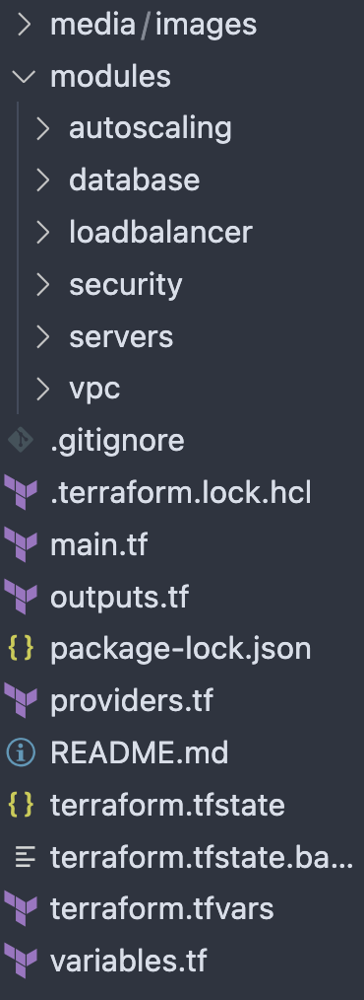
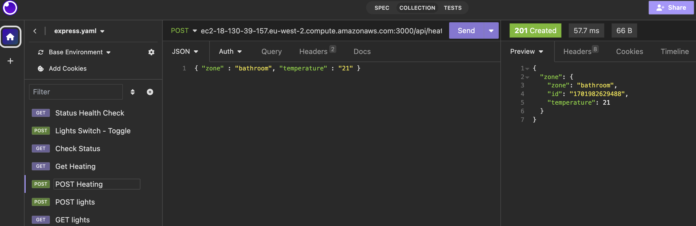
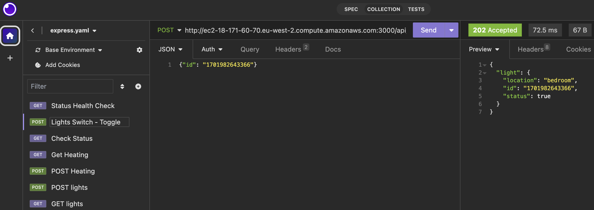

# Smart Home Network of Microservices

## Introduction

When executing the Terraform code for this smart home project, you are automating the set up of a cloud-based infrastructure. This infrastructure creates a hosted network of microservices that mocks a smart home network which includes a central status service, a lighting service, and a heating service. The lighting service allows for the turning on and off light switches in the home. The heating service changes the temperature of each room in a home. The central status service provides the status of the heating and lighting services.

The Terraform code acts as a comprehensive script for your cloud infrastructure, automating interactions with AWS services to create and configure the necessary resources. This infrastructure-as-code approach ensures consistency, efficiency, and reliability, allowing for seamless deployment across different environments such as development and production.

The motivation behind building the Smart Home Project was to gain hands-on experience with AWS and Terraform, and to understand how these technologies can be used to build complex, real-world applications.

### Components Deployed
Virtual Private Cloud (VPC):
* Creates a private and secure cloud environment within AWS. This VPC forms the primary network infrastructure for your smart home services, complete with necessary networking elements like subnets, routing tables, and internet gateways.

EC2 Instances:

* Creates virtual servers in the AWS cloud. These servers perform various functions for the smart home, such as managing the status, lighting, and heating systems.

Application Load Balancer (ALB):

* Sets up a load balancer to evenly distribute incoming network traffic across multiple EC2 instances, enhancing the efficiency and reliability of the system.

Autoscaling Group:

* Implements a dynamic scaling strategy for EC2 instances, automatically adjusting the number of active instances in response to application demand.

DynamoDB Tables:

* Establishes NoSQL database tables within AWS DynamoDB for efficient data storage and retrieval, integral to the smart home's operational data management.

Security Groups:

* Configures security rules to manage and control inbound and outbound traffic for the EC2 instances and the load balancer.

### Functional Capabilities
* Scalability: The infrastructure can automatically adapt to changing load demands, ensuring high performance without manual intervention.

* High Availability: through the use of multiple availability zones and load balancing, the setup guarantees a high level of service availability, minimizing downtime.

* Security and Isolation: The VPC and security groups work together to provide a secure and isolated environment, protecting against unauthorized access and external threats.

* Efficient Data Handling: DynamoDB offers a fast and reliable database solution, catering to the smart home's data processing needs.

* Operational Streamlining: Automation via Terraform reduces manual workload and minimizes the likelihood of configuration errors, leading to smoother operations.

* Monitoring and Management: AWS's in-built tools facilitate real-time monitoring and management of your services, allowing for quick issue resolution and maintenance.

## Contents
1. Technologies and Tools
2. Insights Gained
3. Challenges
4. Set Up Infrastructure
5. Usage
6. Troubleshooting

### Technologies and Tools
**Amazon Web Services, Terraform, Virtual Studio Code, Insomnia, Trello**

In this smart home project, a combination of sophisticated technologies and tools were employed to ensure efficient development, deployment, and management of the cloud-based infrastructure:
* Terraform is a popular Infrastructure as Code software tool that eliminates manual configuration errors and easily duplicates environments for different purposes, such as development, testing and production.
* AWS offers an extensive array of services that cater to almost every aspect of cloud computing. This range includes compute, storage, database, and network services, all crucial for the diverse needs of a smart home project. AWS offers an incredibly large global network, which was chosen as it can the high availability and scalability needed for this project to run efficiently regardless of the users location. 
* Used for constructing and testing HTTP requests, Insomnia played a crucial role in interfacing with the project’s APIs. It enabled thorough testing and validation of various API functionalities, ensuring robustness and reliability in API interactions.
* Visual Studio Code Editor for Terraform Code Served was used for writing and managing the Terraform configurations. Its user-friendly interface, complemented with advanced coding features, contributed to a streamlined and efficient coding process.
* Trello was instrumental in project management, facilitating the organisation and tracking of tasks through a system of boards and tickets. It helped segment the project into manageable tasks, ensuring systematic progress and effective tracking of development milestones.

## Insights Gained

#### Cloud Infrastructure Proficiency
Gained a deeper understanding of AWS services, including EC2, VPC, Load Balancers, and DynamoDB. Learned how to effectively leverage these services to build a scalable and resilient infrastructure.
#### Infrastructure as Code (IaC): 
Developed skills in using Terraform, appreciating its power in automating and managing cloud infrastructure. This included learning about state management, modularity, and the importance of version control in IaC.
#### Security Considerations:
Developed an understanding of the intricacies of cloud security, such as the configuration of security groups, network access control, and best practices in securing cloud resources.
#### Scalability and High Availability:
Learnt the practical aspects of creating a highly available system that can scale dynamically. This included balancing load with autoscaling groups and understanding the significance of multi-AZ deployments.
#### Problem-Solving and Debugging:
 Enhanced problem-solving skills, particularly in debugging issues related to cloud deployments and infrastructure configuration.
#### Cost Management and Optimization:
 Acquired knowledge on managing and optimizing AWS costs, understanding the pricing model, and how to use resources efficiently.

## Challenges 
Throughout the development of the smart home project, several challenges were encountered, particularly in the areas of infrastructure management and configuration. Here's an overview of these challenges and the considerations for future improvements:

#### Creating AMI Images:

One of the primary challenges involved the creation and management of Amazon Machine Images (AMIs). These images are crucial for launching EC2 instances with pre-configured settings.
The process of consistently creating and updating these AMIs to reflect the latest configurations posed a significant challenge, especially in maintaining the uniformity of the environment across different instances.

#### Dynamic DNS Hostname Configuration:

The project required updating the .env.local file of the status server with new DNS hostnames each time the underlying EC2 instances were changed or updated.
This process was not only manual and time-consuming but also prone to errors, impacting the reliability of the status server.

#### Consideration for Improvement: Internal Load Balancer:

To address the challenge of dynamically changing DNS hostnames, the implementation of an internal load balancer is considered.
The internal load balancer can effectively distribute traffic to the server instances without the need for constantly updating the .env.local file. It abstracts the instance-specific details, providing a stable endpoint for the services.
By using the load balancer as a consistent entry point, it removes the dependency on individual instance hostnames, thereby enhancing the robustness and scalability of the system.

#### Future Enhancement Strategies:

Automating the process of AMI creation and updates, possibly through a combination of AWS services like EC2 Image Builder and automation scripts.
Further integration of the load balancing solution with auto-scaling to ensure seamless scaling and load distribution as the demand on the smart home system fluctuates.

## Setup Infrastructure

This section provides a detailed guide on setting up the infrastructure for the smart home project, allowing you to deploy the same environment in different contexts, such as development and production. 

#### Prerequisites 
To run this project, you will need to have the following:
* **Terraform:** which can be downloaded from Terraform's website.
* **AWS Account and CLI:** AWS account and have installed the AWS CLI. Configure the AWS CLI with your credentials.
* **Visual Studio Code:** or another text editor, for editing Terraform files.

#### Setup Steps
1. Clone the Repository: Start by cloning the repository containing the project to your device. Use the command git clone [repository URL].
2. Navigate to the Terraform Directory: Change to the directory where the Terraform configuration files are located. E.g., cd path/to/terraform-files.
3. Terraform Initialization: Run terraform init. This command initializes Terraform, installs required providers, and prepares the environment for deployment.
4. Manage Environment: For managing different environments, use Terraform workspaces. Run terraform workspace new dev for the development environment and terraform workspace new prod for the production environment.
5. Adjust Configuration: Adjust the configuration files for the specific environment. You may need to change variables in variables.tf or terroform.tfvars files for environment-specific configurations such as instance sizes, AMI IDs, etc.
6. Plan the Infrastructure: Run terraform plan. This command shows you what Terraform will do before actually making any changes. 
7. Apply the Configuration: Run terraform apply. Confirm the action when asked. Terraform will now create the resources defined in your configuration files.
8. Accessing the Outputs: After the apply completes, you can use terraform output to see the outputs of your Terraform configuration.
9. Edits: For changes, modify your Terraform files and repeat the plan and apply steps.
10 Cleanup: Once you no longer need the resources, run terraform destroy to remove all resources created by Terraform. 

**Isolation**: Keep your development and production environments completely isolated to prevent accidental changes to production.
**State Files:** Terraform maintains state files for each workspace. Ensure that these are backed up and securely stored.
**Version Control:** Use version control for your Terraform files to track changes and maintain history.

By following these steps, you can set up and manage your smart home project infrastructure in a consistent and repeatable way across different environments. 

## Usage

### Directories and file structure 

The infrastructure has been split into multiple directories which includes modules consisting of each logical component. Each module directory is further explained below. 

* provider.tf file contains the terraform and provider blocks.

* main.tf file contains the references to each module and passes through the variables that are used from the variables.tf file or other modules.
The variables.tf file contains the definition of the variables used throughout the project, which includes the datatype needed and a description of the variables use case.

* variables.tfvars file contains the values of the variables used throughout the project.

* output.tf file contains any output resources. Although this file and some other outputs.tf files used in modules do not contain any outputs, output.tf files have been created throughout for development environments for use when outputs are required. An example use case is to provide the DNS host names for each server to be used in making HTTP requests. 

### Virtual Private Cloud (VPC) Module
The VPC Module creates a Virtual Private Cloud where all resources in the project will be hosted on.

#### variables.tf  
* vpc_name - used to create the name of the VPC to easily distinguish it from other VPCs 
* vpc_cidr_range used to provide a block of IP addresses for use within the VPC
* public_subnets and private_subnets are CIDR ranges which resources in each subnet are able to use 
* availability_zones which are AWS isolated locations inside of regions. 

#### main.tf
* VPC is created with dns host names and support enabled to provide users with a human readable URL when utilising the servers. 
* Public and private subnets are created using the VPC id to connect to the VPC, relevant CIDR blocks to separate them, three availability zones to ensure high availability of services if a zone becomes compromised. The difference between the public and private subnets is the attribute "map_public_ip_on_launch", is set to true for public subnets to ensure that the resources inside them are able to connect to the internet. To provide the dynamic creation of three public and three private subnets a count loop is used which loops through the provided availability zones and public and private CIDR ranges ensuring each are created with separate variable values. Another use of the count loop is to dynamically name each resource in the names tag attribute. 
* Route table is created and associated to each public subnet using a count loop and a route table association. 
* Internet gateway is created to allow for the public subnets to access the internet through connecting the route table and internet gateway together using a route resource. 

#### output.tf
* vpc_id is outputted to be used in creating other resources to ensure they are all deployed inside the same VPC. 
* public_subnets_ids are outputted to be passed to the servers, loadbalancing and autoscaling modules to ensure these resources are connected to the correct subnets and can connect to the internet.

### Security Module
The Security Module is dedicated to establishing security measures within the VPC. The primary focus is on creating security groups and rules that dictate the traffic flow to and from the services running in the VPC. This maintains a secure network environment for the smart home project.

#### variables.tf
* vpc_id is used to ensure  all security groups are associated with the correct VPC

#### local.tf
* ipv4_all_cidr_blocks and ipv6_all_cidr_blocks: These locals define CIDR blocks for IPv4 and IPv6, and are used in security group rules to specify the range of IP addresses allowed for traffic.

#### data.tf
* myipv4address: These data sources fetch the public IPv4 address of the user, which are used in the SSH security group rule to restrict SSH access to the user's IP address only.

#### main.tf

Creates four security groups to be used in establishing secure ingress and egress traffic.
* allow_http: Permits ingress and egress HTTP traffic (port 80) from all external sources.
* allow_https: Allows ingress and egress HTTPS traffic (port 443) from all external sources.
* allow_ssh: Configured to allow SSH access (port 22) specifically from the user's own IP address.
* allow_port_3000: Designed for the lighting application, it allows traffic on port 3000.

Creates rules for ingress and egress traffic that correspond with each security group 
* For allow_http, allow_https, and allow_port_3000, the rules permit traffic from all IPv4 and IPv6 addresses.
* For allow_ssh, the ingress rule is more restrictive, allowing SSH only from the user's IP address for enhanced security.

#### outputs.tf
* security_groups_ids: Outputs the IDs of the created security groups. These IDs are used in the creation of servers, autoscaling groups, and load balancers in other modules, ensuring that the correct security groups are applied to each resource.

### Servers Module
The Servers Module focuses on deploying servers within the  VPC. This module is responsible for provisioning EC2 instances that host the lighting, heating and status services in the smart home project. The use of variables and dynamic counts ensures flexibility and scalability, allowing easy adjustments to the infrastructure based on future needs or changes. 

#### variables.tf
* security_groups_ids: Holds the IDs of security groups that will be attached to the EC2 instances for network security.
* instance_type: Specifies the type of EC2 instance (e.g., t2.micro, t2.large) to be used for the servers, which determine the computing capacity needed.
* public_subnet_ids: Contains the IDs of the public subnets where the EC2 instances will be placed, ensuring they are in the correct network segments and can connect to the internet.
* service_names: A list of names for the servers in order to easily identify them.
* ami_ids: Lists the Amazon Machine Image (AMI) IDs for the instances, defining the pre-configured virtual servers where the services application code has been installed with npm and pm2.
* key_name: Name of the security key used for SSH access to the EC2 instances.

#### main.tf

Inside the main.tf file, the aws_instance resource creates the EC2 instances to be used for the servers and establishes the configurations needed.
* count: Utilises the length of ami_ids to determine the number of instances to be created.
* ami: Specifies which AMI to use for each instance, based on ami_ids.
* instance_type: Determines the computing power of the instances.
* subnet_id: Ensures each instance is deployed in the correct public subnet.
* associate_public_ip_address: Set to true to assign a public IP address to each instance, allowing them to be accessed over the internet.
* vpc_security_group_ids: Attaches the security groups to the instances for network traffic control.
* key_name: Assigns the specified key for SSH access.
* tags: Helps in identifying each server by its service name.

#### outputs.tf
* server_instance_ids: Outputs the IDs of the created EC2 instances. These IDs are used in other modules for managing, monitoring, or linking other resources to these servers.

### Database Module
The Database Module sets up and manages the database infrastructure using Amazon DynamoDB, where the data handling for the smart home project occurs. DynamoDB is a fully managed NoSQL database service that supports key-value data structures, making it ideal for flexible, scalable, and fast data storage and retrieval.

#### variable.tf
* database_tables_names: This variable contains a list of names for the DynamoDB tables to be created. These names identify each table's purpose and links them to the heating and lighting services they are used in.

#### main.tf

Inside the main.tf file, the aws_dynamodb_table resource creates the DynamoDB tables used to store and retrieve data related to the heating and lighting servers.
* count: Uses the length of database_tables_names to determine the number of tables to create.
* name: Sets the name for each DynamoDB table, drawn from database_tables_names.
* billing_mode: Set to "PAY_PER_REQUEST" which is a flexible billing option allowing payment for the capacity used rather than provisioning capacity ahead of time. 
* hash_key: Configured to use "id" as the primary key for the tables. 
* attribute: Defines the attributes for the DynamoDB tables, with the attribute "id" being created with the type "N" (number).
* tags: Dynamically tags each DynamoDB table with a name linked to the server utilising it.

#### outputs.tf

Currently, this file is empty. It can be used to output resources such as the table names or ARNs (Amazon Resource Names) for integration with other AWS services or for management purposes if future service additions are added to the smart home project. 

### Load Balancer Module
The Load Balancer Module in the Smart Home Network project sets up an Application Load Balancer (ALB) to manage and distribute incoming network traffic across multiple servers, ensuring high availability and fault tolerance for the smart home services.

#### variables.tf
* vpc_id: Identifies the VPC in which the load balancer is to be created.
* server_instance_ids: Lists the instance IDs of the servers that will be attached to the target groups of the load balancer.
* security_groups_ids: Contains the IDs of security groups to be associated with the load balancer for traffic control.
* public_subnet_ids: Specifies the public subnet IDs where the load balancer will be located.
* service_names: Names of the services for which the target groups are created.
* target_group_paths: Defines the paths for the servers, which are used to route traffic in the load balancer target groups.

#### main.tf
The aws_lb resource creates the application load balancer.
* name: Used to identify the load balancer.
* load_balancer_type: Specifies the type of load balancer to be created, in this case application.
* internal: Specifies that the load balancer is internet-facing.
* security_groups: Attaches security groups for controlling the traffic.
* subnets: Associates the load balancer with public subnets.

#### outputs.tf
* load_balancer_target_group_arns: Outputs the ARNs (Amazon Resource Names) of the target groups. These ARNs are outputted to be used in associating the load balancer with the autoscaling groups in the autoscaling module.

### Autoscaling Module
The Autoscaling Module creates an autoscaling group in the Smart Home project, which automatically adjusts the number of EC2 instances based on demand. This provides a cost-effective solution by not creating too many instances that may not be utilised but giving the ability to create more resources when demand increases.

#### variables.tf
* service_names: Lists the names of services for which the autoscaling groups are created.
* public_subnet_ids: Contains the IDs of the public subnets where the EC2 instances will be launched.
* ami_ids: Specifies the Amazon Machine Image (AMI) IDs used to create the instances in the autoscaling group.
* key_name: Indicates the name of the SSH key used for instance access.
* security_groups_ids: Holds the IDs of security groups attached to each instance for network security.
* instance_type: Defines the type of EC2 instance to be used, determining the computing resources available.
* load_balancer_target_group_arns: Contains the ARNs of the target groups associated with the load balancer, used for routing traffic to the EC2 instances.
* min_size, max_size, desired_capacity: Defines the minimum, maximum, and desired number of instances in the autoscaling group.

#### main.tf

The aws_launch_template resource creates a launch template for each service.
* name: Used to identify the instance.
* image_id: provides the image Amazon Machine Image (AMI) used in creating the instance. 
* instance_type: Determines the computing power of the instances.
* key_name: Assigns the specified key for SSH access.
* vpc_security_group_ids: Specifies the security groups for the instances.
* tag_specifications: Dynamically adds a name tag to identify the instance.

The aws_autoscaling_group resource defines the autoscaling groups.
* name: Used to identify the autoscaling group.
* min_size, max_size, desired_capacity: Sets up the scaling parameters for the group.
* vpc_zone_identifier: Specifies the public subnets in which instances are launched.
* launch_template: Associates the launch template with the autoscaling group.
* target_group_arns: Links the autoscaling group to the appropriate target group in the load balancer.
* tag: Configures tagging for the instances, with propagate_at_launch set to true to apply the tags to all instances launched in the group.

#### outputs.tf

Currently, this file is empty. It can be used to output resources such as the autoscaling group ids or launch template ids for integration with other AWS services or for management purposes if future service additions are added to the smart home project. 

## Troubleshooting
When encountering issues with the smart home project, particularly with API interactions and server functionality, follow these troubleshooting steps to diagnose and resolve the problems:

### General Troubleshooting
Check API Calls:
* Use tools like a browser, curl, or Insomnia to test the API calls to the DynamoDB database. Ensure that the API endpoints are correctly configured and responding as expected.

Server Health Check:
* Verify the operational status of your servers. This can be done through the AWS Management Console or using AWS CLI commands.
* Ensure that the servers are running and there are no internal errors affecting their performance.

Load Balancer Health:
* Inspect the health of the load balancer by navigating to its DNS hostname, followed by the API URL.
* Check if the load balancer is effectively distributing traffic and if all registered instances are in a healthy state.

### Specific Issues with API Requests
Issues with GET Requests:
* If GET requests are successful but POST requests are failing, start by examining the format of the JSON object in your requests.
* Ensure that the JSON payload is correctly structured, using strings inside an object as required by the API.

#### Using Insomnia:

Configure GET and POST requests in Insomnia, specifying the appropriate headers and payload as per your API's requirements.

API paths to use:
* GET and POST requests to the lights server *api/lights*
* POST request to the lights server to toggle lights *api/lights/switch*
* GET request to the heating server *api/heating*
* GET request to the status server *api/status*
* POST request to the heating server *api/heating/zone*
* Health check to the servers */health*

Check .env.local Files:
* Review the .env.local files on each server (lighting, heating, and status) to ensure they contain the correct configuration and DNS hostnames. This step is crucial, especially if servers have been replaced or their instances have changed, affecting their DNS hostnames.

Input Validation:
* Verify that the input to the API matches what the API is expecting, including the correct format, data types, and absence of unexpected special characters or spaces.

Status Server Check:
* If specific services like lighting and heating are operational, but the status server is not, double-check the .env.local file of the status server for the correct DNS hostnames.

By systematically following these steps, you can identify and rectify common issues related to API calls, server health, and load balancing in your smart home project. This approach ensures a methodical resolution of issues, minimizing downtime and service disruptions.

